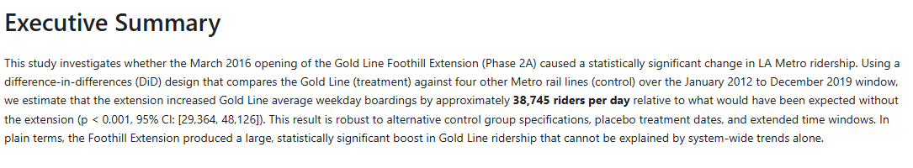
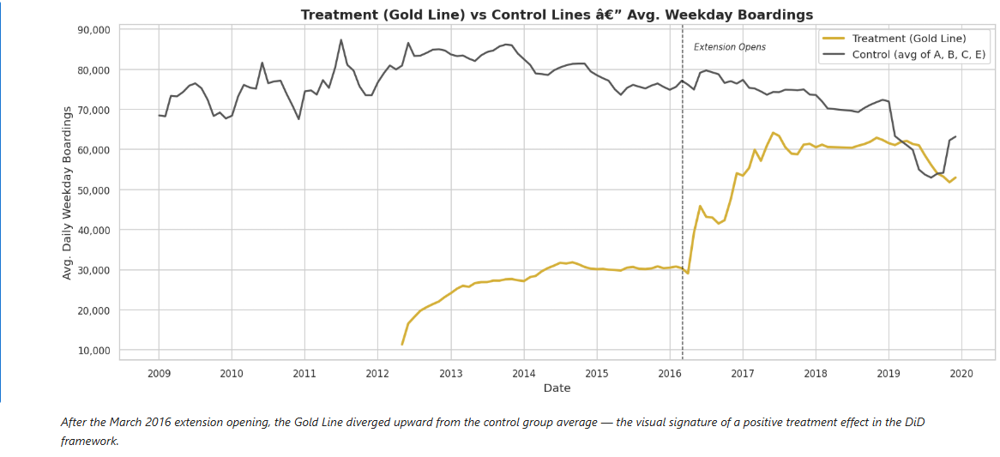
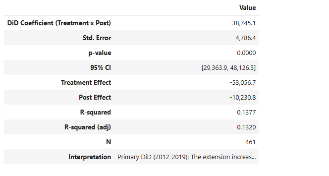
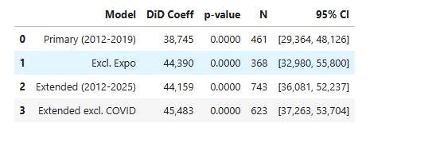

# LA Metro Ridership Impact Analysis

A causal inference study measuring whether the Gold Line Foothill Extension (opened March 2016) produced a statistically significant change in LA Metro ridership. Uses a **difference-in-differences (DiD)** quasi-experimental design comparing the Gold Line (treatment) against four other Metro rail lines (control) over January 2012 – December 2019 — delivered as a single reproducible Jupyter notebook with publication-quality figures and full statistical reporting.

> **Central question:** Did the Gold Line Foothill Extension actually increase ridership, or would growth have happened anyway?

---

## Key Findings

- The Foothill Extension increased Gold Line average weekday boardings by **+38,745 riders/day** relative to control lines (p < 0.001, 95% CI: [29,364, 48,126])
- The effect is **large** (Cohen's d > 0.8) and holds across all four alternative specifications
- **Parallel trends test** detected a significant pre-trend (p = 0.027), meaning the DiD estimate should be interpreted as strong suggestive evidence rather than definitive causal proof
- Results survive excluding the Expo Line (concurrent extension), shifting the treatment window ±6 months, and extending through 2025 with COVID excluded
- The 2018 Q2 system-wide data gap affects treatment and control equally — no bias introduced

---

## Results




*Gold Line diverged upward from control lines after the March 2016 extension opening.*





---

## Methodology

**Difference-in-differences (DiD)** isolates the causal effect by comparing the change in ridership for the treated line to the change for untreated lines over the same period.

```
Y = β₀ + β₁(Treatment) + β₂(Post) + β₃(Treatment × Post) + ε
```

The coefficient **β₃** is the DiD estimator — the causal effect of the extension on ridership, net of system-wide trends.

| Component | Definition |
|-----------|-----------|
| **Treatment** | Gold Line (received Foothill Extension, March 2016) |
| **Control** | A Line (Blue), B/D Line (Red), C Line (Green), E Line (Expo) |
| **Pre-period** | January 2012 – February 2016 |
| **Post-period** | March 2016 – December 2019 (pre-COVID) |

---

## Statistical Tests

| Test | Purpose |
|------|---------|
| Paired t-test / Wilcoxon signed-rank | Pre/post comparison within Gold Line |
| Independent t-test / Mann-Whitney U | Treatment vs control group comparison |
| OLS DiD regression (HC1 robust SEs) | Causal effect estimate with interaction term |
| Shapiro-Wilk | Normality check to justify parametric vs non-parametric |
| Cohen's d | Effect size for all comparisons |

Every result reports: test name, test statistic, p-value, 95% confidence interval, effect size, and plain English interpretation.

---

## Robustness Checks

| Check | What it tests |
|-------|--------------|
| Parallel trends | Pre-period treatment × time interaction — validates DiD assumption |
| Treatment window ±6 months | Whether the effect is specific to March 2016 or a broader trend |
| Exclude Expo Line | Expo had its own extension (May 2016) — removes contaminated control |
| Extended window (2012–2025) | Full dataset including COVID, with and without 2020–2021 |

---

## Data Sources

| Source | What | Granularity | Date Range |
|--------|------|-------------|-----------|
| **Streets For All** | Monthly avg weekday boardings by line | Line-level, monthly | 2009–2025 |
| **Metro GIS** | Station locations, coordinates, opening dates | Point-level | Current |

---

## Project Stats

| | |
|---|---|
| Rail lines analyzed | 6 (Gold, A/Blue, B/D Red, C/Green, E/Expo, K) |
| Monthly observations | 944 (cleaned) |
| Analysis window | January 2012 – December 2019 |
| Data validation tests | 20 (all passing) |
| Statistical tests | 8 (parametric + non-parametric pairs) |
| Robustness specifications | 4 |
| Deliverable | Single Jupyter notebook |

---

## Quick Start

```bash
# Install dependencies
pip install -r requirements.txt

# Run everything: tests + execute notebook
make all

# Individual steps
make setup      # Install dependencies
make test       # Run pytest data validation
make notebook   # Execute notebook top-to-bottom
make clean      # Remove generated files
```

## View the Analysis

```bash
jupyter notebook notebooks/analysis.ipynb
```

---

## Repository Structure

```
├── src/
│   ├── acquire.py       # Data download functions
│   ├── clean.py         # Cleaning and standardization
│   ├── stats.py         # Statistical tests (t-tests, DiD, effect sizes)
│   └── viz.py           # Visualization helpers (seaborn + matplotlib)
├── tests/
│   ├── test_data.py     # Data validation tests (20 assertions)
│   └── test_stats.py    # Statistical function unit tests
├── notebooks/
│   └── analysis.ipynb   # THE deliverable — polished analytical notebook
├── data/
│   ├── raw/             # Downloaded source files (never modified)
│   └── clean/           # Cleaned and standardized files
├── screenshots/         # README figures
├── Makefile             # setup, test, notebook, all, clean
├── requirements.txt     # Pinned dependencies
├── data_inventory.md    # Documentation of all data files
├── PROJECT.md           # Project goals and non-goals
├── REQUIREMENTS.md      # Statistical and data requirements
├── ROADMAP.md           # 4-phase delivery plan
├── STATE.md             # Current status and decisions log
└── CLAUDE.md            # AI coding conventions
```

---

## Limitations

- **Line-level data only** — station-level ridership not publicly available; analysis uses line aggregates
- **Business proximity dropped** — SGV cities don't publish open business license data
- **Parallel trends violated (p = 0.027)** — Gold Line was already diverging before March 2016; DiD estimate is suggestive, not conclusive
- **Regional Connector (June 2023)** — merged Gold Line into A Line; primary analysis ends Dec 2019
- **2018 Q2 data gap** — system-wide reporting gap, affects treatment and control equally
- **COVID confounding** — pandemic disrupted all ridership post-March 2020; excluded from primary spec

---

## Contact

**Aaron Lee**
- GitHub: [github.com/Leeaaronn](https://github.com/Leeaaronn)
- Email: alee190@csu.fullerton.edu
- BS Computer Science, Cal State Fullerton (2025)